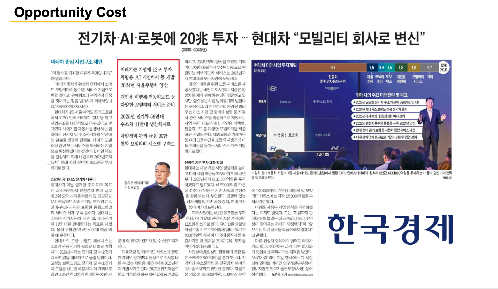
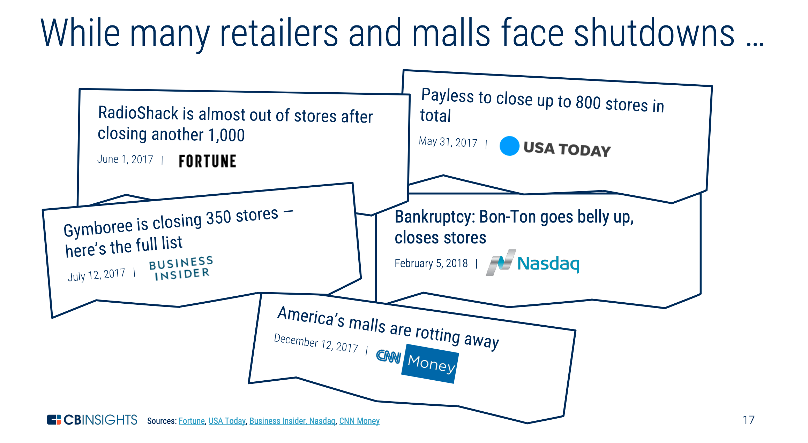

프레젠테이션 자료를 만들다 보면 언론 뉴스를 인용할 경우가 종종 생긴다. 인터넷으로 뉴스를 보는 것이 보편화된 만큼, 기사 웹사이트 화면을 캡처해서 보여주는 경우가 일반적이다. 조금 더 이쁘게 하거나, 심플하게 뉴스를 인용할 때는 아래와 같은 방법이 쓸만할 것 같다.

쓸만한 방법 중에 하나는 [참고 디자인 1]처럼 종이신문을 캡처하는 것이다. 개인적으로 종종 활용하는 방법이다. 주요 언론사들이 지면 PDF 서비스를 제공하고 있는데, 대부분 유료 구독자만 이용 가능하지만, 일부 지면은 무료로도 볼 수 있다.

<!--adsense-->

두 번째 방법은 기사 제목과 날짜, 언론사명만 따오는 방법이다. 테크 리서치 회사 CBinsights가 많이 쓰는 방법이다. 여러 언론사 기사를 한 번에 인용할 필요가 있을 때 활용하면 좋다. [참고 디자인 2]

세 번째 방법은 언론사의 로고와 기사 제목을 발췌하는 방법이다. VC 회사들의 트렌드 보고서 등에서 자주 사용하는 방법이다. 두 번째 방법보다 심플하게 다양한 내용을 보여줄 수 있다. [참고 디자인3]

---
## 참고 디자인1

---
## 참고 디자인2

---
## 참고 디자인3

