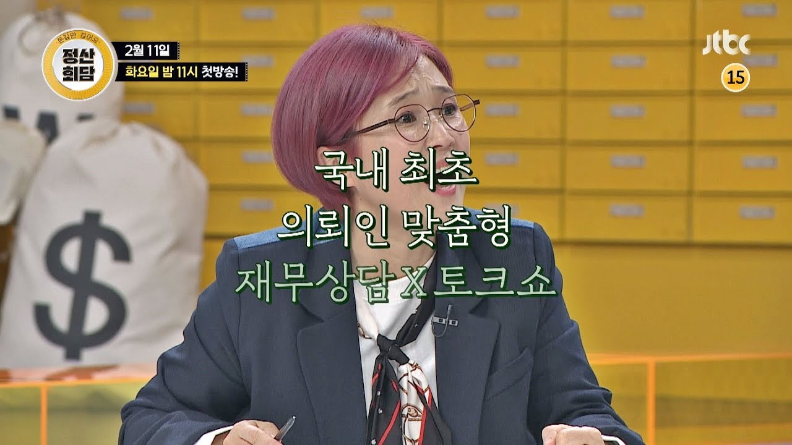

JTBC <정산회담>은 방영한지 몇 회 되지 않았지만, <구해줘! 홈즈>를 연상시키는 재미와 정보의 밸런스가 잡힌 방송이다. <구해줘! 홈즈>가 일반인의 집 구하기를 컨설팅하여 배틀하는 컨셉이라면, <정산회담>은 게스트로 나온 연예인에 대한 재무상담으로 배틀하는 컨셉이다. 과거 한국말을 잘하는 외국인들이 출연하여 화제가 되었던 <정상회담>에서 이름을 따온 듯하고, 메인 MC도 정상회담을 진행했던 전현무가 맡고 있다.

예를 들어, 첫회에서는 아역 스타였던 노형욱이 게스트로 나왔다. 택배 상차, 막노동 등을 전전하다가 오랜만에 드라마 출연으로 생길 수입을 어떻게 사용할 지가 고민이었다. 학자금 대출을 갚는데 쓸지, 아니면 중고차를 사서 연기를 더 편하게 하는데 쓸지를 두고 10명의 재테크 전문가(돈반자)들이 찬반토론을 벌이고, 최종적으로 의뢰인이 한쪽을 선택하여 승부를 가렸다.



의뢰인들의 웃픈 사연들로 인해서 공감되는 포인트도 많다. 특히, 첫 회의 노형욱이 임팩트가 컸다. 아역 스타들이 반짝 떴다가 사라지는 경우를 많이 봐왔는데, 마침 노형욱이 그런 사정이었다. 더군다나 부모님도 일찍 돌아가셔서 홀로 임대아파트에 거주하면서 어렵게 연기의 끈을 놓지 않고 살고 있었다. '윗 세대보다 어렵게 살 첫 세대'라고 불리는 현재의 청년 세대를 어느 정도 대변하는 모습처럼 보이기도 하였다. 그래서 그런 그에게 비록 예능이지만, 소비와 투자 습관에 대한 컨셉을 잡아주는 모습은 비단 그에게만 도움이 되지 않고 많은 시청자들에게도 도움이 될 수 있겠다는 생각이 들었다. 

<정산회담>은 한때 큰 주목을 받았다가 돌연 사라진 [김생민의 영수증](https://namu.wiki/w/%EA%B9%80%EC%83%9D%EB%AF%BC%EC%9D%98%20%EC%98%81%EC%88%98%EC%A6%9D)의 후속판 같기도 하다. 의뢰인의 소비를 분석하기 위해서 카드 영수증 내역을 분석해 보기도 하고, 의뢰인의 수입 상태를 분석하기도 하며, 미래 계획에 따른 투자방법이나 소비 방법 등의 재무 상담을 해주는 기본 골격은 같다. 송은이가 출연해서 더 그런 인상을 받았을런지도 모르겠다. 김생민의 영수증이 개인들의 소비 습관이나 투자에 대해서 적지 않은 정보를 제공했던 것처럼 <정산회담>도 그런 정보를 많이 접해 볼 수 있다. 과거에  가계금융에 대해서 [연구](http://www.lgeri.com/report/view.do?idx=18426)하면서 소비와 자산 및 부채, 현금흐름에 대한 컨셉을 확고히 다지기도 했었는데, <정산회담>을 보면서 그러한 개념들을 반추해 보는 것도 나름 재미가 있었다.

## 나가며...

매일 매일 쓰는 것이 돈이고, 하고 싶은 걸 이루기 위해서 아끼는 것도 돈인데, 정작  돈에 대한 교육은 부족한 것이 현실이다. 어떤 면에서는 돈에 대한 교육을 한때 성교육 마냥 금기시 하는 시선도 여전하다. 세계 10위권의 대표적인 자본주의 사회지만, 투자=투기, 돈=물질 같은 간단한 도식으로 판단하는 문화가 적지 않은 것도 사실이다. ["금융교육 의무화"](https://biz.chosun.com/site/data/html_dir/2020/02/14/2020021402646.html)같은 국민청원이 주목받은 것도 이런 현실에 대해서 문제라고 인식하는 사람들이 많다는 의미라고 생각된다.

그런 맥락에서 금융에 대한 상식을 높여주는 <정산회담>은 정보와 재미를 동시에 준다는 점에서 의미가 있다. 재무상담이 필요하거나 재테크 고민이 있는 친구들에게 소개해줄 만한 퀄리티다. 양세바리와 붐의 물오른 예능감만 보는 것도 재미가 쏠쏠한데, 덤으로 금융 상식을 높여주니 "1석 2조"다. 

요즘은 유튜브나 팟캐스트도 이런 류의 컨텐츠들이 넘쳐나지만, 그래도 지상파나 종편에서 방송하는 것은 파급력 면에선 여전히 차이가 있다. 프로페셔널들의 협업이 만들어 내는 내공도 여전하다. 경제 상식을 높여주는 고퀄리티 예능이 더 많아지길 기대한다.