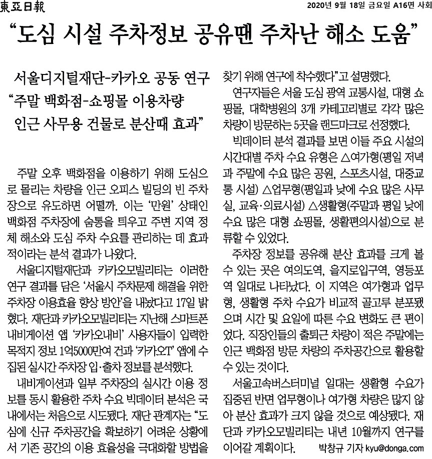

### ㅇ 연구 목표
- 서울시 주차 문제 해결을 위해 주차장 공유의 효과를 추정하여 주차 공유 효과가 나타나는 특성 및 지역을 파악하여 향후 주차장 정보화 시사점 도출

### ㅇ 연구 목차

1. 서론
2. 도심 주차 문제 관련 선행여구 및 사례
3. 서울시 주차 문제 현황
4. 서울시 주차 현황
5. 서울시 주차장 이용 효율 향상 가능성 분석
6. 시사점
 
### ㅇ 주요 내용
- 주차 공유를 위한 정책 및 사례
- 서울시 공영주차장 현황 및 이용 특성 분석
- 빅데이터 기반 주차 수요 도출 및 주차장 공유 효과 분석
- 서울시 주차장 이용 효율 향상을 위한 주차장 정보화 시사점 도출

### ㅇ 관련뉴스
[뉴스모음](https://search.naver.com/search.naver?where=news&query=%EC%B9%B4%EC%B9%B4%EC%98%A4%EB%AA%A8%EB%B9%8C%EB%A6%AC%ED%8B%B0%20%EC%84%9C%EC%9A%B8%EB%94%94%EC%A7%80%ED%84%B8%EC%9E%AC%EB%8B%A8%20%EC%A3%BC%EC%B0%A8&sm=tab_opt&sort=0&photo=0&field=0&reporter_article=&pd=0&ds=&de=&docid=0010011886662&nso=&mynews=0&refresh_start=0&related=1)

