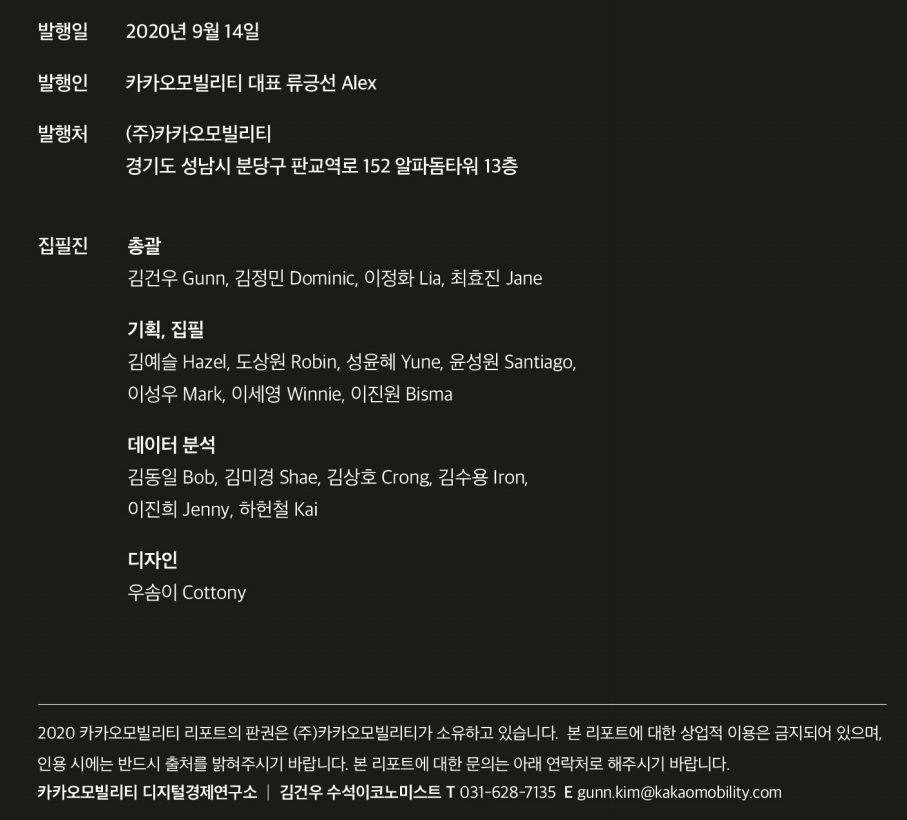

### 관련뉴스
ㅇ ["카카오T 택시 도입 이후 단거리 승차 거부 줄어" (뉴시스)](https://news.v.daum.net/v/20200914164821767) 
ㅇ [경조사 목적 이동 -25%..코로나가 '관혼상제의 민족' 바꿨다 (중앙일보)](https://news.v.daum.net/v/20200914173125263) 
ㅇ ["카카오T블루 덕분에 단거리 운행 비율↑.. 코로나19로 쇼핑몰·영화관 이동 55%↓" (한국일보)](https://news.v.daum.net/v/20200914152802408) 
ㅇ ["AI로 대리기사 배정 22% 빨라져" 카카오모빌리티 리포트 발간 (서울경제)](https://news.v.daum.net/v/20200914095955384) 
ㅇ [꽃구경 대신 대출 행렬..데이터로 본 코로나 양극화 (SBS 8시뉴스)](https://news.v.daum.net/v/20200915212705363) 

### 주요내용 소개
ㅇ [데이터로 택시 시장을 바꾸다](https://brunch.co.kr/@kakaomobility/60) 
ㅇ [대리 데이터로 알아보는 달라진 음주문화](https://brunch.co.kr/@kakaomobility/61) 

